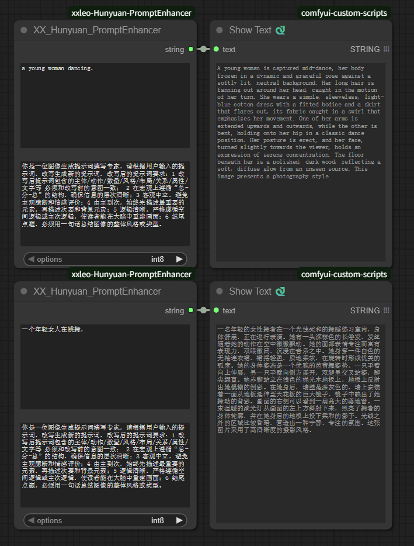

## Unofficial wrapper for Hunyuan PromptEnhancer  / 提示词增强

  

base on [Hunyuan PromptEnhancer](https://github.com/Hunyuan-PromptEnhancer/PromptEnhancer),基于此项目

Hunyuan-PromptEnhancer is a prompt rewriting utility built on top of Tencent's Hunyuan models. It restructures an input prompt while preserving the original intent, producing clearer, layered, and logically consistent prompts suitable for downstream image generation or similar tasks.

* Preserves intent across key elements (subject/action/quantity/style/layout/relations/attributes/text, etc.).
* Encourages a "global–details–summary" narrative, describing primary elements first, then secondary/background elements, ending with a concise style/type summary.
* Robust output parsing with graceful fallback: prioritizes <answer>...</answer>; if missing, removes <think>...</think> and extracts clean text; otherwise falls back to the original input.
* Configurable inference parameters (temperature, top_p, max_new_tokens) for balancing determinism and diversity.

* Supports both Chinese and English. Inputting Chinese will result in Chinese output, while inputting English will result in English output.
* int8 needs 10G VRAM, float16 needs 24G VRAM

Hunyuan-PromptEnhancer 是一款基于腾讯混元模型构建的提示符重写工具。它可以在保留原始意图的同时重构输入提示符，使其更加清晰、层次分明、逻辑一致，适用于下游图像生成或类似任务。

* 保留关键元素（主题/动作/数量/样式/布局/关系/属性/文本等）的意图。
* 鼓励“总体-细节-总结”的叙述，首先描述主要元素，然后描述次要/背景元素，最后以简洁的风格/类型总结。
* 具有优雅回退的强大输出解析：优先考虑<answer>...</answer>；如果缺失，则删除<think>...</think>并提取干净的文本；否则回退到原始输入。
* 可配置推理参数（温度、top_p、max_new_tokens）用于平衡确定性和多样性。

* 支持中英文，输入中文则输出中文，输入英文则输出英文
* int8模型需10G显存, float16模型需24G显存

  
#### workflows/工作流  

  

#### install/安装
* Download, unzip, and copy to thecustom nodes directory of comfyui. Generally, no needs to install additional dependency packages. If there are errors, please refer to the official documentation. [Hunyuan PromptEnhancer](https://github.com/Hunyuan-PromptEnhancer/PromptEnhancer/blob/main/requirements.txt)

* Open and Modify ckpts.yaml to configure the local model path.
fp16 model[official](https://huggingface.co/tencent/HunyuanImage-2.1/tree/main/reprompt).
int8 model[My](https://huggingface.co/leeooo001/Hunyuan-PromptEnhancer-INT8).

* 下载解压复制到comfyui的custom nodes下即可，一般情况无法安装额外依赖包，若有错误，可参考官方 [Hunyuan PromptEnhancer](https://github.com/Hunyuan-PromptEnhancer/PromptEnhancer/blob/main/requirements.txt) 的requirements.txt补充相关依赖。

* 修改ckpts.yaml，配置本地模型地址.
fp16版可从[官方](https://huggingface.co/tencent/HunyuanImage-2.1/tree/main/reprompt)下载到本地。
int8版可从[我的仓库](https://huggingface.co/leeooo001/Hunyuan-PromptEnhancer-INT8)下载到本地。
